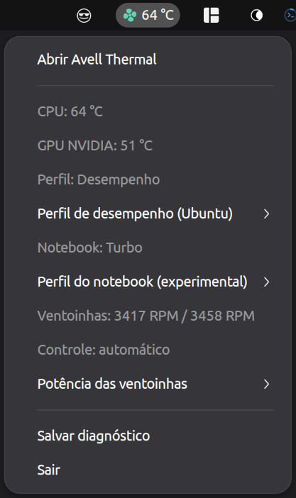
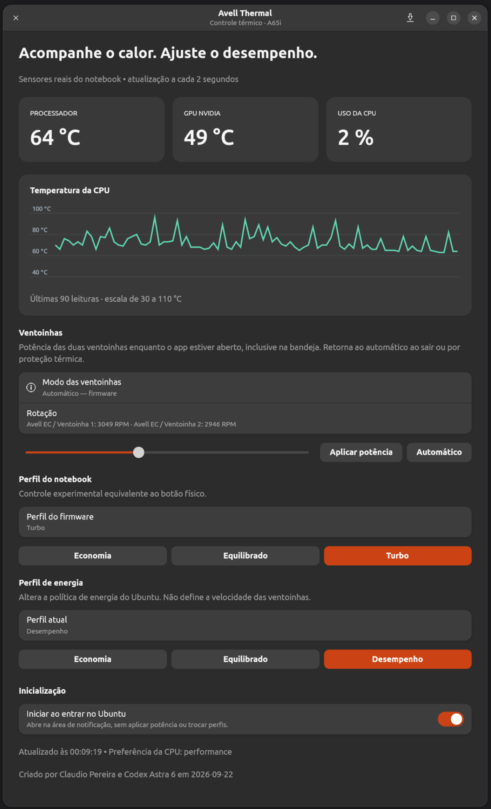

# Avell Thermal

Inspirado no trabalho de [Wallace Martins](https://github.com/wallacemartinss) em https://github.com/wallacemartinss/omarchy-rgb-keyboard, criando soluções para os notebooks Avell.

Aplicativo para GNOME com janela GTK4 e ícone na bandeja, validado neste
**Avell A65i / ION A65i / BIOS N.1.09AVE03**, kernel7.0.0-31-generic.

## Capturas de tela

### Área de notificação



### Interface



## Uso

Abra **Avell Thermal** no menu de aplicativos, ou:

```bash
avell-thermal
```

- **Ventoinhas:** escolha50–100%, em passos de5%, e clique Aplicar potência.
  A mesma potência é aplicada aos dois canais; as rotações reais são exibidas
  separadamente. É controle percentual, não um alvo exato de RPM.
- A autenticação administrativa inicia uma sessão contínua. **Automático**
  devolve o controle ao firmware; para encerrar sua própria sessão não é
  necessária nova autenticação.
- Fechar a janela mantém o app na bandeja e mantém a sessão. **Sair** encerra
  a sessão. Falha do app/auxiliar provoca retorno por fechamento do canal ou
  pelo temporizador de30s do kernel, além do tempo de restauração.
- A bandeja oferece60%,75%,100%,Automático, perfis, temperaturas e RPM.
- **Perfil do notebook:** três estados do botão físico (Economia, Equilibrado,
  Turbo). Os nomes dos dois primeiros são convencionais; limites de potência
  específicos não foram medidos. Turbo corresponde ao LED aceso.
- **Perfil de energia:** política independente do Ubuntu.
- Diagnóstico no botão de salvar ou `python3 app.py --diagnose`.

Manual é encerrado quando CPU>=85°C/GPU>=80°C, sensores falham, o perfil físico
muda ou o firmware não mantém a potência. A sessão usa renovações enquanto a
interface responde; não é retomada automaticamente após suspensão ou reboot.
Abrir o app não aplica uma potência nem troca o perfil. A opção “Iniciar ao entrar no Ubuntu” habilita o ícone no login, sem aplicar potência ou perfis.

## Instalação via APT e DKMS

Após escolher **Automático** e **Sair** no app:

```bash
git clone https://github.com/cpereiraweb/AvellFanControl.git
cd AvellFanControl
python3 packaging/build_deb.py
sudo apt install ./dist/avell-thermal_0.1.5_all.deb
```

Abra pelo menu ou execute `avell-thermal`. O pacote instala a interface, o
ícone, auxiliares privilegiados e fontes do módulo com DKMS. O aplicativo
continua executando como usuário comum. Não inicia controle manual sozinho.

O DKMS recompila o módulo nas atualizações de kernel com headers disponíveis.
Isso elimina a recompilação manual habitual, mas mudanças de API podem exigir
ajustes no driver. O suporte continua restrito ao modelo e BIOS validados.

A instalação antiga é arquivada em `/var/lib/avell-thermal/legacy-backup`
antes de dar lugar ao módulo DKMS. Os scripts `install_boot.sh` e `activate.sh`
são do protótipo; não os execute sobre a instalação gerenciada pelo pacote.
Veja [instalação, migração e remoção](packaging/README.md).

## Validação realizada em22/09/2026

| Potência | Ventoinha1 | Ventoinha2 |
|---|---:|---:|
|50%|3194 RPM|3117 RPM|
|70%|4114 RPM|3885 RPM|
|100%|5337 RPM|5165 RPM|

Valores medidos nas condições do teste, não uma conversão universal entre
percentual e RPM. Três perfis do notebook, três potências, cancelamento,
retorno temporizado, sessão contínua>40s, encerramento do auxiliar e sua morte
forçada foram exercitados. A validação local registrou sucesso dos controles/restauração e do watchdog;
os arquivos brutos de diagnóstico não são distribuídos neste repositório. Suspensão/reboot ainda não
foram exercitados em teste físico desta sessão; o tratamento está implementado.

O bit2 de0741 variou4→0 e foi posteriormente observado em4 com automático.
Seu significado não está documentado. A comparação exige restauração do bit0
manual, controles, tabelas e perfil; reporta essa única variação separadamente,
sem forçá-la por escrita e sem chamar o byte inteiro de idêntico.

Veja [protocolo, evidências e limitações](driver/profiles/README.md),
[análise OEM](research/analise-oem.md) e [pesquisa inicial](research/validacao-driver.md).
O driver TUXEDO completo não foi instalado nem teve sua checagem DMI contornada.
Não carregar outro controlador EC simultaneamente.

## Dependências e verificação

Python3, PyGObject, GTK4/libadwaita/Cairo, GTK3/AyatanaAppIndicator3,
extensão GNOME ubuntu-appindicators, pkexec, powerprofilesctl e nvidia-smi.
Já disponíveis neste notebook. Interface e bandeja usam processos separados
com pipes privados, sem serviço de rede.

```bash
python3 -m unittest discover -s tests -p 'test_*.py'
python3 tests/check_manual_logic.py
python3 tests/check_boost_logic.py driver/profiles/avell_profiles.c
```

Testes de interface explícitos em `tests/check_tray_integration.py` requerem
app fechado. Scripts validate_* em driver/profiles são testes REAIS de
hardware, somente executados deliberadamente com sudo.

## Downloads e releases

Baixe o `.deb` e o arquivo `SHA256SUMS` na [release mais recente](https://github.com/cpereiraweb/AvellFanControl/releases/latest).
Na pasta do download, confira com `sha256sum -c SHA256SUMS` e instale com
`sudo apt install ./avell-thermal_0.1.5_all.deb`.

O workflow executa os testes e gera um artefato em pushes e pull requests.
Tags no formato `vX.Y.Z` publicam o pacote e seu checksum em uma GitHub Release
após os testes. Também é possível gerar artefatos manualmente pela aba Actions.
A compilação DKMS para o kernel do usuário ocorre na instalação, não na CI.
